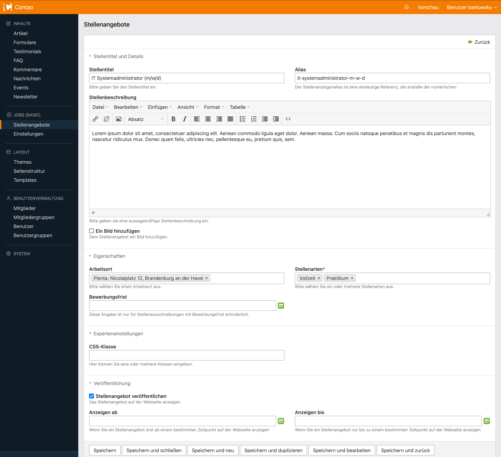

# Contao Jobs Basic Bundle

The perfect solution for your job offer site.

Basic Job Manager for Contao (including Google Jobs)  
Open source and free. 

## Installation

### Install using Contao Manager

Search for **job** or **jobs** and you will find this extension.

### Install using Composer

```bash
composer require plenta/contao-jobs-basic-bundle
```


## System requirements

- PHP: `7.4 || 8.0` (or higher)
- Contao: `^4.9` (or later)


## Screenshot

